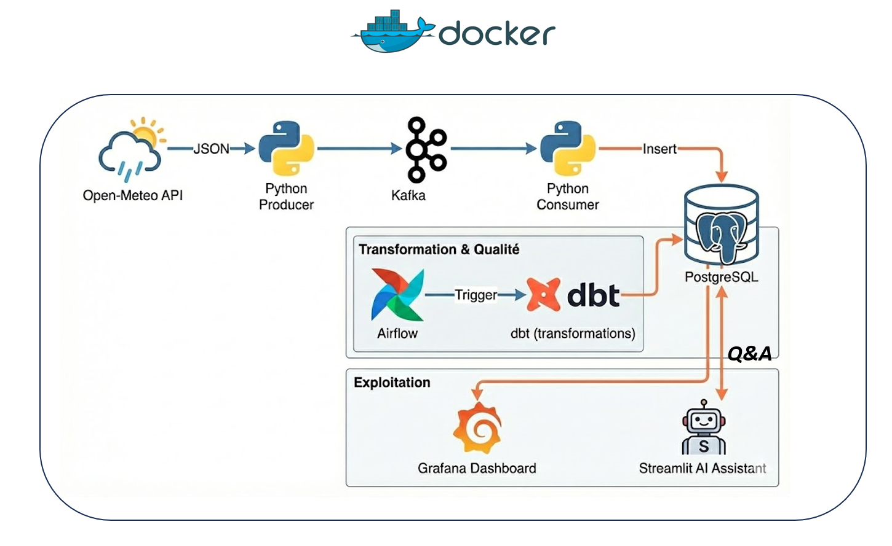
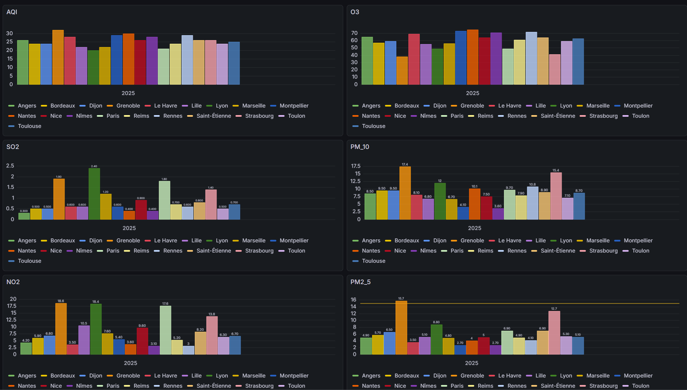
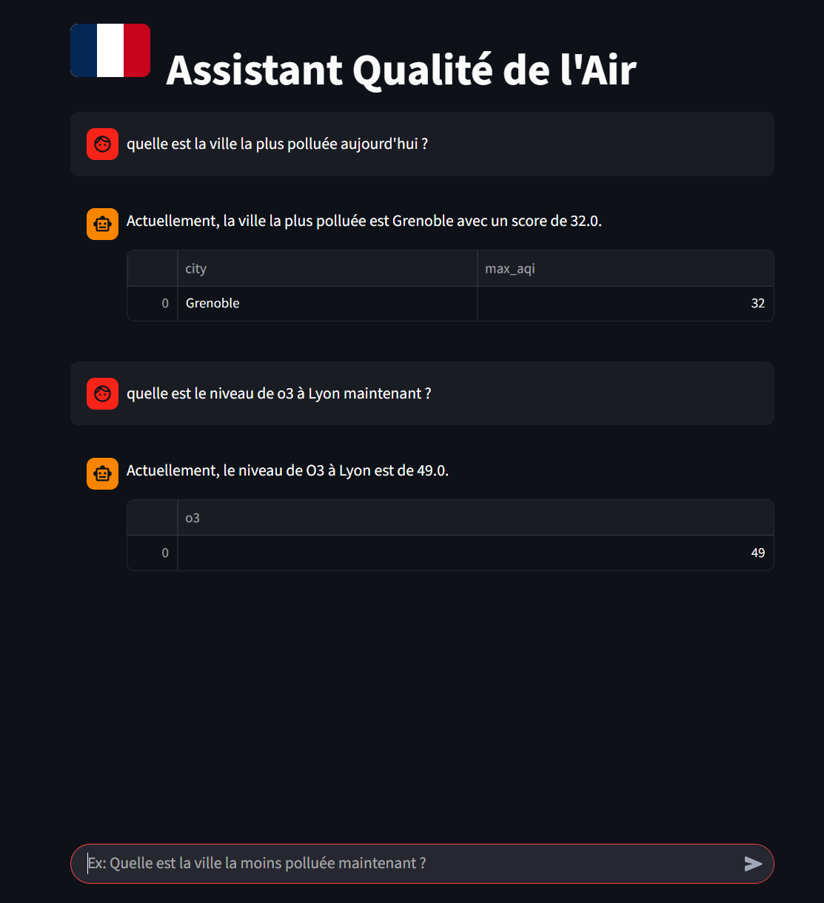

# 🌍 Air Quality Monitor

## 🎯 But du Projet
Ce projet a pour objectif de mettre en place un **pipeline de données complet et robuste** pour surveiller la qualité de l'air en temps réel dans les principales villes de France. 

Il démontre une architecture Data Engineering moderne capable de :
1.  **Ingérer** des données en continu (Kafka) "Mis à jour chaque heure depuisnl'API "Open-Meteo".
2.  **Stocker** et **Historiser** les mesures (PostgreSQL).
3.  **Transformer** et **Nettoyer** la donnée (dbt).
4.  **Orchestrer** les tâches automatiquement (Airflow).
5.  **Visualiser** les indicateurs clés (Grafana).
6.  **Interagir** via une IA générative (Streamlit + LLM).


## 🔄 Pipeline d'Architecture



## 📊 Résultats

Vous trouverez ci-dessous des aperçus du projet en fonctionnement.

### 📊 Dashboards Grafana

Le projet propose deux vues complémentaires pour l'analyse des données :

**1. Évolution Temporelle**
Ce tableau de bord permet de suivre l'historique et les tendances des polluants (PM10, NO2, etc.) sur la durée.


**2. Conditions Actuelles (Temps Réel)**
Une vue instantanée des dernières mesures disponibles pour permettre aux utilisateurs de connaître la qualité de l'air à l'heure actuel.



### 🤖 Assistant IA (Streamlit)
L'assistant intelligent permet d'interroger la base de données en langage naturel. Il traduit les questions de l'utilisateur en **requêtes SQL**, les exécute sur la base PostgreSQL, et fournit une réponse synthétique accompagnée des données brutes.



## 🚀 Comment Lancer le Projet

1.  **Cloner le dépôt**
2.  **Configurer l'environnement**
    *   Créer un fichier `.env` avec votre token Hugging Face : `HUGGINGFACEHUB_API_TOKEN=votre_token`
3.  **Lancer les conteneurs**
    ```bash
    docker-compose up -d --build
    ```

